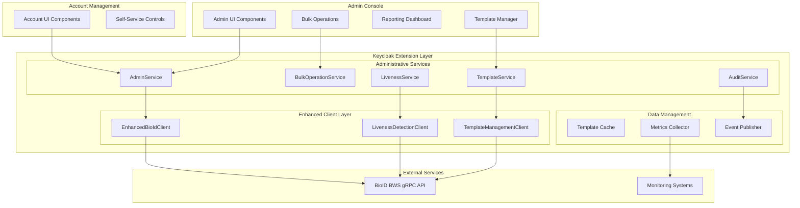

# Design Document

## Overview

The BioID Administrative Features extension enhances the existing Keycloak BioID integration with comprehensive administrative controls, advanced liveness detection capabilities, and template management tools. The design builds upon the existing face authentication system while adding enterprise-grade administrative functionality through Keycloak's admin console and account management interfaces.

The system architecture emphasizes security, scalability, and user experience while providing administrators with powerful tools to manage biometric enrollments, configure liveness detection modes, and monitor system health. The design integrates seamlessly with BioID BWS 3 gRPC services and extends the existing protobuf definitions to support liveness detection operations.

## Architecture

### High-Level Architecture



### Component Architecture

The administrative features are structured around six core service components that extend the existing BioID integration:

1. **AdminService**: Central administrative operations coordinator
2. **TemplateService**: Template status management and monitoring
3. **LivenessService**: Liveness detection configuration and execution
4. **BulkOperationService**: Batch operations for large-scale management
5. **AuditService**: Comprehensive audit logging and compliance
6. **Enhanced Client Layer**: Extended gRPC client with administrative capabilities

## Components and Interfaces

### 1. AdminService Component

**Purpose**: Provides central coordination for all administrative operations

**Key Interfaces**:
```java
@ApplicationScoped
public class AdminService {
    public AdminDashboardData getDashboardData(RealmModel realm);
    public List<UserEnrollmentStatus> getUserEnrollments(RealmModel realm, int offset, int limit);
    public EnrollmentLinkResult generateEnrollmentLink(UserModel user, int validityHours);
    public void deleteUserEnrollment(UserModel user, String reason);
    public ComplianceReport generateComplianceReport(RealmModel realm, LocalDate from, LocalDate to);
    public SystemHealthStatus getSystemHealth();
}
```

**Data Models**:
```java
public class AdminDashboardData {
    private long totalEnrolledUsers;
    private double enrollmentSuccessRate;
    private Map<Integer, Long> templatesByEncoderVersion;
    private List<RecentActivity> recentActivities;
    private SystemHealthMetrics healthMetrics;
    private LivenessDetectionStats livenessStats;
}

public class UserEnrollmentStatus {
    private String userId;
    private String username;
    private String email;
    private boolean enrolled;
    private Instant enrolledAt;
    private Instant lastAuthentication;
    private int encoderVersion;
    private int featureVectors;
    private List<String> tags;
    private TemplateHealthStatus healthStatus;
}

public class EnrollmentLinkResult {
    private String enrollmentUrl;
    private String token;
    private Instant expiresAt;
    private boolean requiresAdminApproval;
}
```

### 2. TemplateService Component

**Purpose**: Manages template status monitoring and lifecycle operations

**Key Interfaces**:
```java
@ApplicationScoped
public class TemplateService {
    public FaceTemplateStatus getTemplateStatus(long classId, boolean includeThumbnails);
    public List<TemplateStatusSummary> getTemplateStatusBatch(List<Long> classIds);
    public TemplateUpgradeResult upgradeTemplate(long classId);
    public BulkUpgradeResult upgradeTemplatesBatch(List<Long> classIds);
    public TemplateHealthReport analyzeTemplateHealth(RealmModel realm);
    public void scheduleTemplateCleanup(RealmModel realm);
}
```

**Template Health Analysis**:
```java
public class TemplateHealthReport {
    private int totalTemplates;
    private int healthyTemplates;
    private int outdatedEncoderVersions;
    private int missingThumbnails;
    private int expiringSoon;
    private List<TemplateIssue> issues;
    private Map<String, Integer> issuesByType;
}

public class TemplateIssue {
    private long classId;
    private String userId;
    private IssueType type;
    private IssueSeverity severity;
    private String description;
    private List<String> recommendedActions;
    private Instant detectedAt;
}

public enum IssueType {
    OUTDATED_ENCODER,
    MISSING_THUMBNAILS,
    EXPIRING_TEMPLATE,
    CORRUPTED_METADATA,
    ORPHANED_CREDENTIAL,
    SYNC_MISMATCH
}
```

### 3. LivenessService Component

**Purpose**: Handles liveness detection configuration and execution

**Key Interfaces**:
```java
@ApplicationScoped
public class LivenessService {
    public LivenessDetectionResponse performLivenessDetection(LivenessDetectionRequest request);
    public LivenessConfiguration getLivenessConfiguration(RealmModel realm);
    public void updateLivenessConfiguration(RealmModel realm, LivenessConfiguration config);
    public LivenessTestResult testLivenessDetection(byte[] image1, byte[] image2, LivenessMode mode);
    public LivenessStatistics getLivenessStatistics(RealmModel realm, LocalDate from, LocalDate to);
}
```

**Liveness Detection Implementation**:
```java
public class LivenessDetectionRequest {
    private List<ImageData> liveImages;
    private LivenessMode mode;
    private double threshold;
    private List<ChallengeDirection> challengeDirections;
}

public class LivenessDetectionResponse {
    private JobStatus status;
    private List<JobError> errors;
    private List<ImageProperties> imageProperties;
    private boolean live;
    private double livenessScore;
    private LivenessDetails details;
}

public class LivenessDetails {
    private double passiveLivenessScore;
    private double activeLivenessScore;
    private boolean challengeResponsePassed;
    private List<ChallengeResult> challengeResults;
    private String rejectionReason;
}

public enum LivenessMode {
    PASSIVE,           // Single image texture analysis
    ACTIVE,            // Two images with motion detection
    CHALLENGE_RESPONSE // Two images with head movement validation
}

public enum ChallengeDirection {
    UP, DOWN, LEFT, RIGHT
}
```

### 4. BulkOperationService Component

**Purpose**: Handles batch operations for large-scale administrative tasks

**Key Interfaces**:
```java
@ApplicationScoped
public class BulkOperationService {
    public BulkOperationResult<EnrollmentLinkResult> generateBulkEnrollmentLinks(
        List<UserModel> users, int validityHours);
    public BulkOperationResult<Void> deleteBulkTemplates(List<Long> classIds, String reason);
    public BulkOperationResult<TemplateUpgradeResult> upgradeBulkTemplates(List<Long> classIds);
    public BulkOperationResult<Void> setBulkTemplateTags(List<Long> classIds, List<String> tags);
    public BulkOperationStatus getBulkOperationStatus(String operationId);
    public void cancelBulkOperation(String operationId);
}
```

**Bulk Operation Management**:
```java
public class BulkOperationResult<T> {
    private String operationId;
    private BulkOperationStatus status;
    private int totalItems;
    private int processedItems;
    private int successfulItems;
    private int failedItems;
    private List<BulkOperationError> errors;
    private List<T> results;
    private Instant startedAt;
    private Instant completedAt;
}

public class BulkOperationError {
    private String itemId;
    private String errorCode;
    private String errorMessage;
    private boolean retryable;
    private int attemptCount;
}

public enum BulkOperationStatus {
    PENDING,
    RUNNING,
    COMPLETED,
    FAILED,
    CANCELLED,
    PARTIALLY_COMPLETED
}
```

### 5. Enhanced gRPC Client Layer

**Purpose**: Extends the existing BioIdClient with administrative and liveness detection capabilities

**Extended Client Interface**:
```java
public interface EnhancedBioIdClient extends BioIdClient {
    // Liveness Detection Methods
    LivenessDetectionResponse livenessDetection(LivenessDetectionRequest request) throws BioIdException;
    
    // Batch Operations
    List<FaceTemplateStatus> getTemplateStatusBatch(List<Long> classIds, boolean includeThumbnails) throws BioIdException;
    BulkDeleteResult deleteTemplatesBatch(List<Long> classIds) throws BioIdException;
    
    // Health and Monitoring
    ServiceHealthStatus getServiceHealth();
    ConnectionMetrics getConnectionMetrics();
    
    // Regional Endpoint Management
    void switchToRegion(String region);
    List<String> getAvailableRegions();
    String getCurrentRegion();
}
```

**Liveness Detection Client Implementation**:
```java
@ApplicationScoped
public class LivenessDetectionClient {
    private final ManagedChannel channel;
    private final BioIDWebServiceGrpc.BioIDWebServiceStub asyncStub;
    private final BioIDWebServiceGrpc.BioIDWebServiceBlockingStub blockingStub;
    
    public CompletableFuture<LivenessDetectionResponse> livenessDetectionAsync(
            List<byte[]> images, LivenessMode mode) {
        
        LivenessDetectionRequest.Builder requestBuilder = LivenessDetectionRequest.newBuilder();
        
        for (byte[] imageBytes : images) {
            ImageData imageData = ImageData.newBuilder()
                .setImage(ByteString.copyFrom(imageBytes))
                .build();
            requestBuilder.addLiveImages(imageData);
        }
        
        // Add challenge tags for challenge-response mode
        if (mode == LivenessMode.CHALLENGE_RESPONSE && images.size() == 2) {
            List<String> challengeTags = generateChallengeTags();
            ImageData secondImage = requestBuilder.getLiveImages(1).toBuilder()
                .addAllTags(challengeTags)
                .build();
            requestBuilder.setLiveImages(1, secondImage);
        }
        
        CompletableFuture<LivenessDetectionResponse> future = new CompletableFuture<>();
        
        asyncStub.livenessDetection(requestBuilder.build(), new StreamObserver<LivenessDetectionResponse>() {
            @Override
            public void onNext(LivenessDetectionResponse response) {
                future.complete(response);
            }
            
            @Override
            public void onError(Throwable t) {
                future.completeExceptionally(new BioIdException("Liveness detection failed", t));
            }
            
            @Override
            public void onCompleted() {
                // Response already completed in onNext
            }
        });
        
        return future;
    }
    
    private List<String> generateChallengeTags() {
        // Generate random challenge directions
        List<ChallengeDirection> directions = Arrays.asList(
            ChallengeDirection.UP, ChallengeDirection.DOWN, 
            ChallengeDirection.LEFT, ChallengeDirection.RIGHT
        );
        Collections.shuffle(directions);
        
        return directions.subList(0, 2).stream()
            .map(Enum::name)
            .collect(Collectors.toList());
    }
}
```

## Data Models

### Extended Protobuf Definitions

**LivenessDetection Service Addition**:
```protobuf
// Add to facerecognition.proto service definition
service FaceRecognition {
    // ... existing methods ...
    
    // Performs liveness detection on one or two live images
    rpc LivenessDetection (LivenessDetectionRequest) returns (LivenessDetectionResponse);
}

// Liveness detection request
message LivenessDetectionRequest {
    // List of one or two live images for liveness detection
    repeated ImageData live_images = 1;
}

// Liveness detection response
message LivenessDetectionResponse {
    // The return-status of the processing job
    JobStatus status = 1;
    // Any error messages collected during processing
    repeated JobError errors = 2;
    // Calculated image properties for each provided image
    repeated ImageProperties image_properties = 3;
    // Liveness decision - true if images are from a live person
    bool live = 4;
    // Confidence score between 0.0 and 1.0
    double liveness_score = 5;
}
```

### Administrative Data Models

**Configuration Model**:
```java
public class AdminConfiguration {
    // Liveness Detection Settings
    private LivenessMode defaultLivenessMode = LivenessMode.PASSIVE;
    private double livenessThreshold = 0.7;
    private boolean enableChallengeResponse = false;
    private List<ChallengeDirection> allowedChallengeDirections = Arrays.asList(
        ChallengeDirection.UP, ChallengeDirection.DOWN, 
        ChallengeDirection.LEFT, ChallengeDirection.RIGHT
    );
    
    // Template Management Settings
    private int templateCleanupIntervalHours = 24;
    private int templateExpirationDays = 730;
    private boolean autoUpgradeTemplates = false;
    private int maxBulkOperationSize = 100;
    
    // Performance Settings
    private int templateCacheTtlMinutes = 5;
    private int bulkOperationTimeoutMinutes = 30;
    private int maxConcurrentOperations = 5;
    
    // Audit Settings
    private boolean enableDetailedAuditLogging = true;
    private int auditRetentionDays = 365;
    private boolean exportAuditToSiem = false;
}
```

**Metrics and Monitoring Models**:
```java
public class SystemHealthMetrics {
    private ServiceStatus bioIdServiceStatus;
    private double averageResponseTime;
    private int activeConnections;
    private long totalRequests24h;
    private long failedRequests24h;
    private double errorRate;
    private Map<String, Integer> errorsByType;
    private Instant lastHealthCheck;
}

public class LivenessDetectionStats {
    private long totalLivenessChecks;
    private long passedLivenessChecks;
    private double passRate;
    private Map<LivenessMode, Long> checksByMode;
    private Map<String, Long> rejectionReasons;
    private double averageLivenessScore;
}

public enum ServiceStatus {
    HEALTHY,
    DEGRADED,
    UNHEALTHY,
    UNKNOWN
}
```

## User Interface Components

### Admin Console Extensions

**Template Management Dashboard**:
```javascript
// React component for template management
const TemplateManagementDashboard = () => {
    const [templates, setTemplates] = useState([]);
    const [selectedTemplates, setSelectedTemplates] = useState([]);
    const [bulkOperation, setBulkOperation] = useState(null);
    
    const handleBulkUpgrade = async () => {
        const result = await adminService.upgradeBulkTemplates(selectedTemplates);
        setBulkOperation(result);
    };
    
    const handleBulkDelete = async () => {
        const confirmed = await showConfirmDialog(
            'Delete Templates', 
            `Are you sure you want to delete ${selectedTemplates.length} templates?`
        );
        if (confirmed) {
            const result = await adminService.deleteBulkTemplates(selectedTemplates);
            setBulkOperation(result);
        }
    };
    
    return (
        <PageSection>
            <Card>
                <CardHeader>
                    <Title headingLevel="h2">Template Management</Title>
                    <CardActions>
                        <Button 
                            variant="primary" 
                            onClick={handleBulkUpgrade}
                            isDisabled={selectedTemplates.length === 0}
                        >
                            Upgrade Selected
                        </Button>
                        <Button 
                            variant="danger" 
                            onClick={handleBulkDelete}
                            isDisabled={selectedTemplates.length === 0}
                        >
                            Delete Selected
                        </Button>
                    </CardActions>
                </CardHeader>
                <CardBody>
                    <TemplateTable 
                        templates={templates}
                        selectedTemplates={selectedTemplates}
                        onSelectionChange={setSelectedTemplates}
                    />
                </CardBody>
            </Card>
            {bulkOperation && (
                <BulkOperationProgress operation={bulkOperation} />
            )}
        </PageSection>
    );
};
```

**Liveness Detection Configuration**:
```javascript
const LivenessConfigurationPanel = () => {
    const [config, setConfig] = useState({});
    const [testResult, setTestResult] = useState(null);
    
    const handleTestLiveness = async (images, mode) => {
        const result = await livenessService.testLivenessDetection(images, mode);
        setTestResult(result);
    };
    
    return (
        <Form>
            <FormGroup label="Liveness Detection Mode" fieldId="liveness-mode">
                <FormSelect
                    value={config.defaultLivenessMode}
                    onChange={(value) => setConfig({...config, defaultLivenessMode: value})}
                >
                    <FormSelectOption value="PASSIVE" label="Passive (Single Image)" />
                    <FormSelectOption value="ACTIVE" label="Active (Two Images)" />
                    <FormSelectOption value="CHALLENGE_RESPONSE" label="Challenge-Response" />
                </FormSelect>
            </FormGroup>
            
            <FormGroup label="Liveness Threshold" fieldId="liveness-threshold">
                <NumberInput
                    value={config.livenessThreshold}
                    onMinus={() => setConfig({...config, livenessThreshold: Math.max(0, config.livenessThreshold - 0.1)})}
                    onPlus={() => setConfig({...config, livenessThreshold: Math.min(1, config.livenessThreshold + 0.1)})}
                    onChange={(event) => setConfig({...config, livenessThreshold: parseFloat(event.target.value)})}
                    min={0}
                    max={1}
                    step={0.1}
                />
            </FormGroup>
            
            <FormGroup label="Challenge Directions" fieldId="challenge-directions">
                <Checkbox
                    label="Up"
                    isChecked={config.allowedChallengeDirections?.includes('UP')}
                    onChange={(checked) => updateChallengeDirections('UP', checked)}
                />
                <Checkbox
                    label="Down"
                    isChecked={config.allowedChallengeDirections?.includes('DOWN')}
                    onChange={(checked) => updateChallengeDirections('DOWN', checked)}
                />
                <Checkbox
                    label="Left"
                    isChecked={config.allowedChallengeDirections?.includes('LEFT')}
                    onChange={(checked) => updateChallengeDirections('LEFT', checked)}
                />
                <Checkbox
                    label="Right"
                    isChecked={config.allowedChallengeDirections?.includes('RIGHT')}
                    onChange={(checked) => updateChallengeDirections('RIGHT', checked)}
                />
            </FormGroup>
            
            <ActionGroup>
                <Button variant="primary" onClick={saveConfiguration}>
                    Save Configuration
                </Button>
                <Button variant="secondary" onClick={() => setShowTestDialog(true)}>
                    Test Liveness Detection
                </Button>
            </ActionGroup>
        </Form>
    );
};
```

### Account Management Extensions

**User Self-Service Interface**:
```javascript
const FaceAuthenticationAccount = () => {
    const [enrollmentStatus, setEnrollmentStatus] = useState(null);
    const [templateStatus, setTemplateStatus] = useState(null);
    
    const handleDeleteEnrollment = async () => {
        const confirmed = await showConfirmDialog(
            'Delete Face Authentication',
            'This will permanently delete your biometric template. You can re-enroll at any time.'
        );
        if (confirmed) {
            await accountService.deleteEnrollment();
            setEnrollmentStatus(null);
            setTemplateStatus(null);
        }
    };
    
    return (
        <Card>
            <CardHeader>
                <Title headingLevel="h3">Face Authentication</Title>
            </CardHeader>
            <CardBody>
                {enrollmentStatus?.enrolled ? (
                    <div>
                        <Alert variant="success" title="Face authentication is enabled">
                            You enrolled on {formatDate(enrollmentStatus.enrolledAt)} and last 
                            authenticated on {formatDate(enrollmentStatus.lastAuthentication)}.
                        </Alert>
                        
                        <DescriptionList>
                            <DescriptionListGroup>
                                <DescriptionListTerm>Template Version</DescriptionListTerm>
                                <DescriptionListDescription>
                                    {templateStatus?.encoderVersion} 
                                    {templateStatus?.needsUpgrade && (
                                        <Label color="orange">Upgrade Available</Label>
                                    )}
                                </DescriptionListDescription>
                            </DescriptionListGroup>
                            <DescriptionListGroup>
                                <DescriptionListTerm>Feature Vectors</DescriptionListTerm>
                                <DescriptionListDescription>
                                    {templateStatus?.featureVectors}
                                </DescriptionListDescription>
                            </DescriptionListGroup>
                        </DescriptionList>
                        
                        <ActionGroup>
                            <Button variant="danger" onClick={handleDeleteEnrollment}>
                                Delete Face Authentication
                            </Button>
                            <Button variant="secondary" onClick={downloadPersonalData}>
                                Download My Data
                            </Button>
                        </ActionGroup>
                    </div>
                ) : (
                    <div>
                        <Alert variant="info" title="Face authentication is not enabled">
                            You can enable face authentication for passwordless login.
                        </Alert>
                        <Button variant="primary" onClick={startEnrollment}>
                            Enable Face Authentication
                        </Button>
                    </div>
                )}
            </CardBody>
        </Card>
    );
};
```

## Error Handling

### Enhanced Error Classification

**Administrative Error Types**:
```java
public enum AdminErrorType {
    // Template Management Errors
    TEMPLATE_NOT_FOUND("Template does not exist for the specified class ID"),
    TEMPLATE_CORRUPTED("Template data is corrupted or invalid"),
    TEMPLATE_UPGRADE_FAILED("Template upgrade operation failed"),
    TEMPLATE_SYNC_MISMATCH("Template status mismatch between Keycloak and BioID"),
    
    // Liveness Detection Errors
    LIVENESS_DETECTION_FAILED("Liveness detection operation failed"),
    INVALID_LIVENESS_MODE("Unsupported liveness detection mode"),
    CHALLENGE_RESPONSE_FAILED("Challenge-response validation failed"),
    INSUFFICIENT_IMAGES("Insufficient images for requested liveness mode"),
    
    // Bulk Operation Errors
    BULK_OPERATION_TIMEOUT("Bulk operation exceeded maximum execution time"),
    BULK_OPERATION_CANCELLED("Bulk operation was cancelled by user"),
    PARTIAL_BULK_FAILURE("Bulk operation completed with some failures"),
    CONCURRENT_OPERATION_LIMIT("Maximum concurrent operations exceeded"),
    
    // Configuration Errors
    INVALID_CONFIGURATION("Configuration contains invalid values"),
    CONFIGURATION_CONFLICT("Configuration conflicts with existing settings"),
    PERMISSION_DENIED("Insufficient permissions for requested operation"),
    
    // Service Errors
    SERVICE_UNAVAILABLE("BioID service is temporarily unavailable"),
    RATE_LIMIT_EXCEEDED("API rate limit exceeded"),
    QUOTA_EXCEEDED("Service quota exceeded"),
    REGION_UNAVAILABLE("Requested region is not available");
}
```

**Error Recovery Strategies**:
```java
@Component
public class AdminErrorHandler {
    
    public <T> T executeWithRetry(Supplier<T> operation, AdminErrorType... retryableErrors) {
        Set<AdminErrorType> retryableSet = Set.of(retryableErrors);
        int maxAttempts = 3;
        int attempt = 0;
        
        while (attempt < maxAttempts) {
            try {
                return operation.get();
            } catch (AdminException e) {
                attempt++;
                if (!retryableSet.contains(e.getErrorType()) || attempt >= maxAttempts) {
                    throw e;
                }
                
                // Exponential backoff
                try {
                    Thread.sleep(1000 * (1L << (attempt - 1)));
                } catch (InterruptedException ie) {
                    Thread.currentThread().interrupt();
                    throw new AdminException(AdminErrorType.BULK_OPERATION_CANCELLED, 
                        "Operation interrupted", ie);
                }
            }
        }
        
        throw new AdminException(AdminErrorType.SERVICE_UNAVAILABLE, 
            "Operation failed after " + maxAttempts + " attempts");
    }
    
    public BulkOperationResult<T> handleBulkOperationErrors(
            List<T> items, Function<T, R> operation) {
        
        BulkOperationResult<R> result = new BulkOperationResult<>();
        result.setTotalItems(items.size());
        
        for (T item : items) {
            try {
                R operationResult = operation.apply(item);
                result.addSuccess(operationResult);
            } catch (Exception e) {
                BulkOperationError error = new BulkOperationError();
                error.setItemId(getItemId(item));
                error.setErrorMessage(e.getMessage());
                error.setRetryable(isRetryableError(e));
                result.addError(error);
            }
        }
        
        return result;
    }
}
```

### Circuit Breaker for Administrative Operations

```java
@Component
public class AdminCircuitBreaker {
    private final Map<String, CircuitBreaker> circuitBreakers = new ConcurrentHashMap<>();
    
    public CircuitBreaker getCircuitBreaker(String operation) {
        return circuitBreakers.computeIfAbsent(operation, key -> 
            CircuitBreaker.ofDefaults(key)
                .withFailureRateThreshold(50)
                .withWaitDurationInOpenState(Duration.ofSeconds(30))
                .withSlidingWindowSize(10)
                .withMinimumNumberOfCalls(5)
        );
    }
    
    public <T> T executeWithCircuitBreaker(String operation, Supplier<T> supplier) {
        CircuitBreaker circuitBreaker = getCircuitBreaker(operation);
        return circuitBreaker.executeSupplier(supplier);
    }
}
```

## Testing Strategy

### Administrative Feature Testing

**Unit Testing Approach**:
```java
@ExtendWith(MockitoExtension.class)
class AdminServiceTest {
    
    @Mock
    private EnhancedBioIdClient bioIdClient;
    
    @Mock
    private TemplateService templateService;
    
    @InjectMocks
    private AdminService adminService;
    
    @Test
    void shouldGenerateEnrollmentLink() {
        // Given
        UserModel user = createTestUser();
        int validityHours = 24;
        
        // When
        EnrollmentLinkResult result = adminService.generateEnrollmentLink(user, validityHours);
        
        // Then
        assertThat(result.getEnrollmentUrl()).isNotNull();
        assertThat(result.getToken()).isNotNull();
        assertThat(result.getExpiresAt()).isAfter(Instant.now().plusSeconds(validityHours * 3600 - 60));
    }
    
    @Test
    void shouldHandleBulkOperationFailures() {
        // Given
        List<Long> classIds = Arrays.asList(1L, 2L, 3L);
        when(bioIdClient.deleteTemplate(1L)).thenThrow(new BioIdException("Template not found"));
        when(bioIdClient.deleteTemplate(2L)).thenReturn(new DeleteTemplateResponse());
        when(bioIdClient.deleteTemplate(3L)).thenReturn(new DeleteTemplateResponse());
        
        // When
        BulkOperationResult<Void> result = adminService.deleteBulkTemplates(classIds, "Test deletion");
        
        // Then
        assertThat(result.getTotalItems()).isEqualTo(3);
        assertThat(result.getSuccessfulItems()).isEqualTo(2);
        assertThat(result.getFailedItems()).isEqualTo(1);
        assertThat(result.getErrors()).hasSize(1);
    }
}
```

**Integration Testing for Liveness Detection**:
```java
@QuarkusTest
class LivenessDetectionIntegrationTest {
    
    @Inject
    LivenessService livenessService;
    
    @Test
    void shouldPerformPassiveLivenessDetection() throws Exception {
        // Given
        byte[] liveImage = loadTestImage("live-face.jpg");
        LivenessDetectionRequest request = new LivenessDetectionRequest();
        request.setLiveImages(Arrays.asList(ImageData.from(liveImage)));
        request.setMode(LivenessMode.PASSIVE);
        request.setThreshold(0.7);
        
        // When
        LivenessDetectionResponse response = livenessService.performLivenessDetection(request);
        
        // Then
        assertThat(response.isLive()).isTrue();
        assertThat(response.getLivenessScore()).isGreaterThan(0.7);
        assertThat(response.getStatus()).isEqualTo(JobStatus.SUCCEEDED);
    }
    
    @Test
    void shouldPerformChallengeResponseLivenessDetection() throws Exception {
        // Given
        byte[] image1 = loadTestImage("face-neutral.jpg");
        byte[] image2 = loadTestImage("face-turned-left.jpg");
        
        LivenessDetectionRequest request = new LivenessDetectionRequest();
        request.setLiveImages(Arrays.asList(
            ImageData.from(image1),
            ImageData.from(image2, Arrays.asList("LEFT"))
        ));
        request.setMode(LivenessMode.CHALLENGE_RESPONSE);
        request.setChallengeDirections(Arrays.asList(ChallengeDirection.LEFT));
        
        // When
        LivenessDetectionResponse response = livenessService.performLivenessDetection(request);
        
        // Then
        assertThat(response.isLive()).isTrue();
        assertThat(response.getDetails().isChallengeResponsePassed()).isTrue();
    }
}
```

### Performance Testing

**Load Testing for Bulk Operations**:
```java
@Test
void shouldHandleConcurrentBulkOperations() throws Exception {
    int numberOfThreads = 10;
    int operationsPerThread = 50;
    ExecutorService executor = Executors.newFixedThreadPool(numberOfThreads);
    CountDownLatch latch = new CountDownLatch(numberOfThreads);
    
    List<Future<BulkOperationResult<Void>>> futures = new ArrayList<>();
    
    for (int i = 0; i < numberOfThreads; i++) {
        final int threadId = i;
        Future<BulkOperationResult<Void>> future = executor.submit(() -> {
            try {
                List<Long> classIds = generateTestClassIds(operationsPerThread, threadId);
                return bulkOperationService.deleteBulkTemplates(classIds, "Load test");
            } finally {
                latch.countDown();
            }
        });
        futures.add(future);
    }
    
    latch.await(5, TimeUnit.MINUTES);
    
    // Verify all operations completed successfully
    for (Future<BulkOperationResult<Void>> future : futures) {
        BulkOperationResult<Void> result = future.get();
        assertThat(result.getStatus()).isIn(BulkOperationStatus.COMPLETED, BulkOperationStatus.PARTIALLY_COMPLETED);
    }
}
```

## Security Considerations

### Administrative Access Control

**Role-Based Access Control**:
```java
@Component
public class AdminSecurityService {
    
    public boolean hasAdminPermission(KeycloakSession session, String permission) {
        AuthenticationSessionModel authSession = session.getContext().getAuthenticationSession();
        if (authSession == null) {
            return false;
        }
        
        UserModel user = authSession.getAuthenticatedUser();
        RealmModel realm = session.getContext().getRealm();
        
        return user.hasRole(realm.getRole("admin")) || 
               user.hasRole(realm.getRole("face-auth-admin")) ||
               hasSpecificPermission(user, realm, permission);
    }
    
    private boolean hasSpecificPermission(UserModel user, RealmModel realm, String permission) {
        switch (permission) {
            case "manage-enrollments":
                return user.hasRole(realm.getRole("enrollment-manager"));
            case "manage-templates":
                return user.hasRole(realm.getRole("template-manager"));
            case "configure-liveness":
                return user.hasRole(realm.getRole("security-admin"));
            case "view-reports":
                return user.hasRole(realm.getRole("compliance-officer"));
            default:
                return false;
        }
    }
}
```

**Audit Logging Enhancement**:
```java
@Component
public class EnhancedAuditService {
    
    public void logAdminAction(AdminActionType action, String adminUserId, 
                              String targetUserId, Map<String, Object> details) {
        
        AdminAuditEvent event = new AdminAuditEvent();
        event.setAction(action);
        event.setAdminUserId(adminUserId);
        event.setTargetUserId(targetUserId);
        event.setTimestamp(Instant.now());
        event.setDetails(details);
        event.setIpAddress(getCurrentIpAddress());
        event.setUserAgent(getCurrentUserAgent());
        
        // Store in Keycloak events
        keycloakEventStore.save(event);
        
        // Export to SIEM if configured
        if (configuration.isExportAuditToSiem()) {
            siemExporter.export(event);
        }
        
        // Log for compliance
        complianceLogger.info("Admin action: {} by {} on {} with details: {}", 
            action, adminUserId, targetUserId, details);
    }
}

public enum AdminActionType {
    ENROLLMENT_CREATED,
    ENROLLMENT_DELETED,
    TEMPLATE_UPGRADED,
    BULK_OPERATION_STARTED,
    BULK_OPERATION_COMPLETED,
    LIVENESS_CONFIG_CHANGED,
    TEMPLATE_STATUS_ACCESSED,
    COMPLIANCE_REPORT_GENERATED
}
```

This comprehensive design provides a robust foundation for implementing the administrative features while maintaining security, performance, and user experience. The integration with BioID BWS 3 ensures enterprise-grade capabilities with proper error handling, template management, and liveness detection functionality.