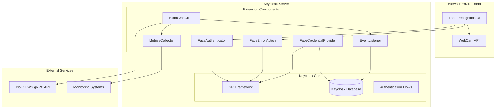

# Design Document

## Overview

The Keycloak BioID Face Recognition Extension is designed as a modular, privacy-preserving authentication system that integrates BioID's BWS 3 gRPC service with Keycloak's authentication framework. The extension follows Keycloak's SPI (Service Provider Interface) architecture to provide seamless face-based authentication without storing biometric data locally.

The system architecture emphasizes security, performance, and user experience while maintaining GDPR compliance through external biometric storage and comprehensive audit trails. The design supports multiple deployment scenarios including single-node and clustered Keycloak environments.

## Architecture

### High-Level Architecture



### Component Architecture

The extension is structured around five core components that integrate with Keycloak's SPI framework:

1. **FaceAuthenticator**: Handles authentication flow integration
2. **FaceEnrollAction**: Manages biometric enrollment process
3. **FaceCredentialProvider**: Manages credential storage and retrieval
4. **BioIdGrpcClient**: Handles communication with BioID services
5. **Supporting Services**: Metrics, events, and configuration management

## Components and Interfaces

### 1. FaceAuthenticator Component

**Purpose**: Integrates face verification into Keycloak authentication flows

**Key Interfaces**:
```java
public class FaceAuthenticator implements Authenticator {
    public void authenticate(AuthenticationFlowContext context);
    public void action(AuthenticationFlowContext context);
    public boolean requiresUser();
    public boolean configuredFor(KeycloakSession session, RealmModel realm, UserModel user);
}
```

**Responsibilities**:
- Render face capture UI during authentication
- Process captured face images
- Coordinate with BioIdGrpcClient for verification
- Handle authentication success/failure flows
- Manage retry logic and fallback mechanisms

**Configuration Options**:
- Verification threshold (0.001 - 1.0 range)
- Maximum retry attempts (default: 3)
- Liveness detection mode (PASSIVE, ACTIVE, CR)
- Fallback authentication methods

### 2. FaceEnrollAction Component

**Purpose**: Manages the biometric enrollment process as a required action

**Key Interfaces**:
```java
public class FaceEnrollAction implements RequiredActionProvider {
    public void evaluateTriggers(RequiredActionContext context);
    public void requiredActionChallenge(RequiredActionContext context);
    public void processAction(RequiredActionContext context);
}
```

**Responsibilities**:
- Present enrollment UI with camera preview
- Validate captured images for quality and angle diversity
- Coordinate multi-frame enrollment with BioID
- Store enrollment metadata as credentials
- Provide real-time feedback during enrollment

**Enrollment Process Flow**:
1. Initialize camera and display preview
2. Capture minimum 3 frames with distinct yaw angles (±30°)
3. Validate image quality and facial detection
4. Submit frames to BioID Enroll service
5. Store template metadata on success
6. Provide completion confirmation

### 3. FaceCredentialProvider Component

**Purpose**: Manages face credential storage and lifecycle

**Key Interfaces**:
```java
public class FaceCredentialProvider implements CredentialProvider {
    public CredentialModel createCredential(RealmModel realm, UserModel user, FaceCredentialModel credentialModel);
    public boolean deleteCredential(RealmModel realm, UserModel user, String credentialId);
    public FaceCredentialModel getCredentialFromModel(CredentialModel model);
}
```

**Data Model**:
```java
public class FaceCredentialModel {
    private long classId;             // BioID template identifier (int64)
    private Instant createdAt;        // Enrollment timestamp
    private int imageCount;           // Number of enrollment images
    private int encoderVersion;       // BioID encoder version
    private int featureVectors;       // Number of feature vectors in template
    private int thumbnailsStored;     // Number of thumbnails stored
    private Instant expiresAt;        // Template expiration
    private List<String> tags;        // Template tags for grouping
    private TemplateType templateType; // COMPACT, STANDARD, FULL
}
```

**Storage Strategy**:
- Credentials stored encrypted in Keycloak database
- No raw biometric data persisted locally
- Template metadata only for audit and management
- Automatic cleanup of expired credentials

### 4. BioIdGrpcClient Component

**Purpose**: Handles all communication with BioID BWS gRPC services

**Key Interfaces**:
```java
public class BioIdGrpcClient {
    public FaceEnrollmentResponse enroll(long classId, List<ImageData> images) throws BioIdException;
    public FaceVerificationResponse verify(long classId, ImageData image) throws BioIdException;
    public DeleteTemplateResponse deleteTemplate(long classId) throws BioIdException;
    public FaceTemplateStatus getTemplateStatus(long classId, boolean downloadThumbnails) throws BioIdException;
    public SetTemplateTagsResponse setTemplateTags(long classId, List<String> tags) throws BioIdException;
}
```

**Connection Management**:
- gRPC channel pooling per Keycloak node
- Automatic connection retry with exponential backoff
- Health check monitoring every 30 seconds
- JWT token authentication with automatic renewal
- Regional endpoint failover capability (face.bws-eu.bioid.com, face.bws-us.bioid.com, etc.)

**JWT Authentication**:
```java
public class BioIdJwtTokenProvider {
    public String generateToken(String clientId, String secretKey, int expireMinutes) {
        // Generate JWT token for BioID BWS authentication
        // Token includes client ID, expiration, and is signed with secret key
    }
    
    public boolean isTokenExpired(String token) {
        // Check if current JWT token needs renewal
    }
}
```

**Error Handling Strategy**:
```java
public enum BioIdErrorCode {
    // BWS Job Errors
    NO_SUITABLE_FACE_IMAGE("NoSuitableFaceImage"),     // No face or multiple faces found
    NO_FEATURE_VECTORS("NoFeatureVectors"),            // Cannot extract feature vectors
    DIFFERENT_FEATURE_VERSIONS("DifferentFeatureVersions"), // Feature version mismatch
    
    // gRPC Status Codes
    CANCELLED(1),              // Client cancelled request
    UNKNOWN(2),                // Unexpected server behavior
    INVALID_ARGUMENT(3),       // Invalid input parameters
    DEADLINE_EXCEEDED(4),      // Request timeout
    NOT_FOUND(5),              // Template not found
    INTERNAL(13),              // Critical system error
    UNAVAILABLE(14),           // Service temporarily unavailable
    UNAUTHENTICATED(16);       // Invalid authentication credentials
}

public enum EnrollmentAction {
    NONE,                      // No action performed
    NEW_TEMPLATE_CREATED,      // New template created
    TEMPLATE_UPDATED,          // Existing template updated
    TEMPLATE_UPGRADED,         // Template upgraded to newer encoder
    ENROLLMENT_FAILED          // Enrollment failed with errors
}
```

### 5. User Interface Components

**Enrollment UI Features**:
- Real-time camera preview with overlay guides
- Progress indicators for multi-frame capture
- Visual feedback for head positioning
- Error messaging with retry options
- Accessibility support with screen reader compatibility

**Authentication UI Features**:
- Single-frame capture interface
- Liveness detection prompts (smile, head movement)
- Progress indicators during verification
- Fallback option presentation
- Mobile-responsive design

**Admin Configuration UI**:
- PatternFly-based settings panel
- Real-time configuration validation
- Metrics dashboard integration
- Deletion request management interface
- Bulk operations support

## Data Models

### Face Credential Storage Model

```json
-- Stored as encrypted JSON in credential_data column
{
  "classId": 1234567890123456789,
  "createdAt": "2024-01-15T10:30:00Z",
  "imageCount": 3,
  "encoderVersion": 5,
  "featureVectors": 3,
  "thumbnailsStored": 3,
  "expiresAt": "2026-01-15T10:30:00Z",
  "tags": ["employee", "high-security"],
  "templateType": "STANDARD",
  "enrollmentAction": "NEW_TEMPLATE_CREATED",
  "enrollmentMetadata": {
    "userAgent": "Chrome/120.0",
    "ipAddress": "192.168.1.100",
    "deviceFingerprint": "hash-value",
    "bwsJobId": "550e8400-e29b-41d4-a716-446655440000"
  }
}
```

### Configuration Data Model

```properties
# BioID BWS 3 Service Configuration
bioid.endpoint=grpcs://face.bws-eu.bioid.com:443  # EU region
# bioid.endpoint=grpcs://face.bws-us.bioid.com:443  # US region
# bioid.endpoint=grpcs://face.bws-sa.bioid.com:443  # South America region
bioid.clientId=${BWS_CLIENT_ID}     # From BWS Portal registration
bioid.key=${BWS_KEY}                # From BWS Portal registration
bioid.jwtExpireMinutes=60           # JWT token expiration time

# Authentication Settings
verification.threshold=0.015        # Score threshold (0.0-1.0, lower = stricter)
verification.maxRetries=3           # Max verification attempts before fallback
verification.timeoutSeconds=4       # gRPC call timeout for verification
enrollment.timeoutSeconds=7         # gRPC call timeout for enrollment

# Template Management
template.ttl.days=730              # Template expiration (2 years default)
template.cleanupInterval.hours=24  # Cleanup job frequency
template.type=STANDARD             # COMPACT, STANDARD, FULL
template.encryption.enabled=true   # Enable template encryption

# Performance Settings
grpc.channelPool.size=5            # Connection pool size per node
grpc.keepAlive.timeSeconds=30      # Keep-alive interval
grpc.retry.maxAttempts=3           # Retry attempts for transient failures
grpc.retry.backoffMultiplier=2.0   # Exponential backoff multiplier

# Health Check Settings
healthCheck.interval.seconds=30    # BioID service health check frequency
healthCheck.timeout.seconds=5      # Health check timeout
```

### Event Data Model

```java
public class FaceAuthenticationEvent {
    private String eventType;        // ENROLL_SUCCESS, VERIFY_FAIL, etc.
    private String userId;
    private String realmId;
    private String clientId;
    private String ipAddress;
    private Instant timestamp;
    private Map<String, String> details; // verification score, error codes, etc.
    private String sessionId;
}
```

## Error Handling

### Error Classification and Recovery

**Retryable Errors**:
- Face not detected in image
- Multiple faces detected
- Poor image quality
- Temporary network issues
- BioID service temporarily unavailable

**Non-Retryable Errors**:
- Template not found (requires enrollment)
- Invalid credentials or authentication
- Permanent service configuration errors
- User account disabled or locked

**Error Recovery Strategies**:

1. **Automatic Retry with Backoff**:
   ```java
   @Retryable(
       value = {BioIdTemporaryException.class},
       maxAttempts = 3,
       backoff = @Backoff(delay = 1000, multiplier = 2.0)
   )
   public VerifyResponse verifyWithRetry(String classId, byte[] image) {
       return bioIdClient.verify(classId, image);
   }
   ```

2. **Graceful Degradation**:
   - Fallback to alternative authentication methods
   - Offline mode with cached decisions (limited scope)
   - Service health-based routing

3. **User Experience Preservation**:
   - Clear error messaging with actionable guidance
   - Automatic fallback option presentation
   - Progress preservation across retries

### Circuit Breaker Pattern

```java
@Component
public class BioIdCircuitBreaker {
    private final CircuitBreaker circuitBreaker;
    
    public BioIdCircuitBreaker() {
        this.circuitBreaker = CircuitBreaker.ofDefaults("bioId")
            .withFailureRateThreshold(50)
            .withWaitDurationInOpenState(Duration.ofSeconds(30))
            .withSlidingWindowSize(10);
    }
}
```

## Testing Strategy

### Unit Testing Approach

**Component Testing**:
- Mock BioID gRPC responses for deterministic testing
- Test all error conditions and edge cases
- Validate credential storage and retrieval
- Test configuration parsing and validation

**Coverage Requirements**:
- Minimum 80% line coverage
- 100% coverage for critical security paths
- All error handling paths tested

### Integration Testing

**BioID Service Integration**:
- Contract tests against BioID staging environment
- End-to-end enrollment and verification flows
- Liveness detection mode validation
- Error scenario simulation

**Keycloak Integration**:
- Authentication flow integration testing
- Required action workflow validation
- Admin console functionality testing
- Event and metrics generation verification

### Browser Compatibility Testing

**Supported Browsers**:
- Chrome 90+ (desktop and mobile)
- Firefox 88+ (desktop and mobile)
- Safari 14+ (desktop and mobile)
- Edge 90+ (desktop)

**Testing Matrix**:
- WebCam API functionality across browsers
- UI responsiveness on different screen sizes
- Performance benchmarking
- Accessibility compliance validation

### Security Testing

**Security Validation**:
- OWASP ASVS Level 2 compliance testing
- Penetration testing by external vendor
- Data flow security analysis
- Encryption validation for stored credentials

**Privacy Testing**:
- Verify no biometric data stored locally
- Audit trail completeness validation
- GDPR compliance verification
- Data retention policy enforcement

### Performance Testing

**Load Testing Scenarios**:
- Concurrent enrollment operations
- High-volume verification requests
- BioID service latency simulation
- Keycloak cluster behavior under load

**Performance Benchmarks**:
- Enrollment completion time < 60 seconds
- Verification latency < 4 seconds P95
- UI responsiveness < 200ms for interactions
- Memory usage within acceptable limits

## Security Considerations

### Data Protection

**Biometric Data Handling**:
- Zero persistence of raw face images
- Immediate disposal of image data after processing
- Encrypted transmission to BioID services
- Secure memory handling for temporary image storage

**Credential Security**:
- Database encryption for stored metadata
- Secure random generation for ClassId values
- Regular credential rotation capabilities
- Audit logging for all credential operations

### Communication Security

**gRPC Security**:
- TLS 1.3 encryption for all communications
- Optional mutual TLS with client certificates
- Certificate pinning for production deployments
- Secure credential storage for BioID authentication

**Network Security**:
- Regional endpoint selection for data residency
- Network timeout and retry configurations
- DDoS protection considerations
- Firewall rule recommendations

### Authentication Security

**Anti-Spoofing Measures**:
- Mandatory liveness detection
- Configurable liveness modes based on risk
- Challenge-response for high-security scenarios
- Behavioral analysis integration points

**Session Security**:
- Secure session token handling
- Session timeout enforcement
- Cross-site request forgery protection
- Secure cookie configuration

## BioID BWS 3 Integration Details

### Biometric Template Management

**Template Types**:
- **Compact Template** (~8.2KB): Contains only biometric template for recognition operations
- **Standard Template** (~24KB+): Includes feature vectors for template updates
- **Full Template** (variable): Includes thumbnails for encoder version upgrades

**Template Lifecycle**:
```java
public enum TemplateType {
    COMPACT,    // Minimal template for verification only
    STANDARD,   // Template with feature vectors for updates
    FULL        // Template with thumbnails for upgrades
}

public class TemplateManagement {
    public void upgradeTemplate(long classId) {
        // Upgrade existing template to newer encoder version
        // Uses stored thumbnails from FULL template
    }
    
    public void updateTemplate(long classId, List<ImageData> newImages) {
        // Add new feature vectors to existing template
        // Uses stored feature vectors from STANDARD template
    }
}
```

### Biometric Class ID (BCID) Management

**BCID Structure**:
- **Storage**: BWS installation location (managed by BioID)
- **Partition**: Unique number assigned to BWS client (from BWS Portal)
- **Class ID**: 64-bit unique identifier managed by Keycloak extension

```java
public class BiometricClassIdManager {
    private final long partition;  // From BWS Portal client configuration
    
    public long generateClassId(String userId, String realmId) {
        // Generate unique 64-bit class ID for user
        // Combines user ID hash with timestamp and random component
        return generateUniqueId(userId, realmId);
    }
    
    public boolean isValidClassId(long classId) {
        // Validate class ID is positive 64-bit number
        return classId > 0;
    }
}
```

### JWT Authentication Implementation

**Token Generation**:
```java
public class BioIdJwtTokenProvider {
    private final String clientId;
    private final String secretKey;
    
    public String generateToken(int expireMinutes) {
        return Jwts.builder()
            .setSubject(clientId)
            .setIssuedAt(new Date())
            .setExpiration(new Date(System.currentTimeMillis() + expireMinutes * 60000))
            .signWith(SignatureAlgorithm.HS256, secretKey)
            .compact();
    }
    
    public void addAuthorizationHeader(Metadata headers, String token) {
        headers.put(Metadata.Key.of("authorization", Metadata.ASCII_STRING_MARSHALLER), 
                   "Bearer " + token);
    }
}
```

### Quality Assessment Integration

**Image Quality Validation**:
```java
public class ImageQualityAssessment {
    public boolean validateEnrollmentImages(List<ImageData> images) {
        for (ImageData image : images) {
            ImageProperties properties = analyzeImage(image);
            
            // Check quality assessments
            for (QualityAssessment qa : properties.getQualityAssessmentsList()) {
                if ("FaceFound".equals(qa.getCheck()) && qa.getScore() < 0.8) {
                    return false; // No suitable face found
                }
                if ("SingleFaceOnImage".equals(qa.getCheck()) && qa.getScore() < 0.8) {
                    return false; // Multiple faces detected
                }
                if ("FaceFeaturesAvailable".equals(qa.getCheck()) && qa.getScore() < 0.8) {
                    return false; // Cannot extract features
                }
            }
        }
        return true;
    }
}
```

### Regional Endpoint Management

**Endpoint Selection Strategy**:
```java
public class RegionalEndpointManager {
    private final Map<String, String> regionalEndpoints = Map.of(
        "eu-west", "grpcs://face.bws-eu.bioid.com:443",
        "us-east", "grpcs://face.bws-us.bioid.com:443",
        "sa-east", "grpcs://face.bws-sa.bioid.com:443"
    );
    
    public String selectOptimalEndpoint(String preferredRegion) {
        return regionalEndpoints.getOrDefault(preferredRegion, 
               regionalEndpoints.get("eu-west")); // Default fallback
    }
    
    public void performHealthCheck(String endpoint) {
        // Monitor endpoint availability and latency
        // Switch to backup region if primary fails
    }
}
```

### BioID BWS 3 API Methods

#### GetTemplateStatus Method

**Purpose**: Fetches biometric face template status and optionally thumbnail images.

**Request Structure**:
```java
message FaceTemplateStatusRequest {
    int64 classId = 1;                    // Unique class ID of the template
    bool download_thumbnails = 2;         // Flag to include thumbnail images
}
```

**Response Structure**:
```java
message FaceTemplateStatus {
    int64 classId = 1;                    // Class ID associated with template
    bool available = 2;                   // Template exists flag
    google.protobuf.Timestamp enrolled = 3; // Last enrollment timestamp
    repeated string tags = 4;             // Template tags
    int32 encoder_version = 5;            // Encoder version used
    int32 feature_vectors = 6;            // Number of feature vectors
    int32 thumbnails_stored = 7;          // Number of stored thumbnails
    repeated Thumbnail thumbnails = 8;    // Optional thumbnail images
    
    message Thumbnail {
        google.protobuf.Timestamp enrolled = 1; // Enrollment timestamp
        bytes image = 2;                        // PNG thumbnail data
    }
}
```

**Error Codes**:
- `NOT_FOUND (5)`: Template does not exist for specified class ID
- `INVALID_ARGUMENT (3)`: Invalid class ID (must be positive)
- `UNAUTHENTICATED (16)`: Invalid JWT authentication
- `UNAVAILABLE (14)`: Service temporarily unavailable

**Usage in Extension**:
- Template status validation during authentication
- Administrative template management
- Template upgrade eligibility checking
- Audit and compliance reporting

#### DeleteTemplate Method

**Purpose**: Permanently deletes all biometric data for a class ID.

**Request Structure**:
```java
message DeleteTemplateRequest {
    int64 classId = 1;                    // Class ID to delete
}
```

**Response**: Empty response (success indicated by no exception)

**Error Codes**:
- `NOT_FOUND (5)`: Template does not exist for specified class ID
- `INVALID_ARGUMENT (3)`: Invalid class ID (must be positive)
- `UNAUTHENTICATED (16)`: Invalid JWT authentication
- `UNAVAILABLE (14)`: Service temporarily unavailable

**GDPR Compliance**:
- Complete removal of all biometric data
- Irreversible deletion process
- Audit trail logging required
- Immediate effect (no recovery possible)

#### Template Security and Encryption

**Template Encryption Levels**:
- **Compact Templates**: Optionally encrypted (impacts search performance ~50% slower)
- **Standard Templates**: Always encrypted (contains feature vectors)
- **Full Templates**: Always encrypted (contains thumbnails and feature vectors)

**Digital Signatures**:
- All templates digitally signed to prevent tampering
- Signature verification on every template load
- Cryptographic integrity protection

**Performance Considerations**:
- Encrypted templates significantly impact database search performance
- Recommended to use unencrypted compact templates for high-volume search
- Standard/Full templates always encrypted for security

#### Template Upgrade Process

**Encoder Version Management**:
```java
public class TemplateUpgradeManager {
    public boolean canUpgradeTemplate(FaceTemplateStatus status) {
        // Check if template has stored thumbnails for upgrade
        return status.getThumbnailsStored() > 0 && 
               status.getEncoderVersion() < getCurrentEncoderVersion();
    }
    
    public void upgradeTemplate(long classId) throws BioIdException {
        // 1. Get template status with thumbnails
        FaceTemplateStatusRequest request = FaceTemplateStatusRequest.newBuilder()
            .setClassId(classId)
            .setDownloadThumbnails(true)
            .build();
            
        FaceTemplateStatus status = bioIdClient.getTemplateStatus(request);
        
        // 2. Use thumbnails to create new template with current encoder
        List<ImageData> thumbnailImages = convertThumbnailsToImageData(status.getThumbnailsList());
        
        // 3. Enroll with existing thumbnails (will upgrade automatically)
        FaceEnrollmentRequest enrollRequest = FaceEnrollmentRequest.newBuilder()
            .setClassId(classId)
            .addAllImages(thumbnailImages)
            .build();
            
        bioIdClient.enroll(enrollRequest);
    }
}
```

#### Error Handling Enhancements

**Template Not Found Handling**:
```java
public class EnhancedErrorHandler {
    public void handleTemplateNotFound(long classId, String operation) {
        // Log the missing template scenario
        logger.warn("Template not found for class ID: {} during operation: {}", classId, operation);
        
        // For verification: redirect to enrollment
        if ("verify".equals(operation)) {
            triggerEnrollmentRequiredAction();
        }
        
        // For deletion: treat as already deleted (idempotent)
        if ("delete".equals(operation)) {
            logger.info("Template already deleted for class ID: {}", classId);
        }
        
        // For status check: return unavailable status
        if ("getStatus".equals(operation)) {
            return createUnavailableStatus(classId);
        }
    }
}
```

This comprehensive design provides a robust foundation for implementing the Keycloak BioID extension while maintaining security, performance, and user experience requirements. The integration with BioID BWS 3 ensures enterprise-grade biometric authentication capabilities with proper error handling, template management, and GDPR compliance.